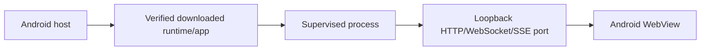
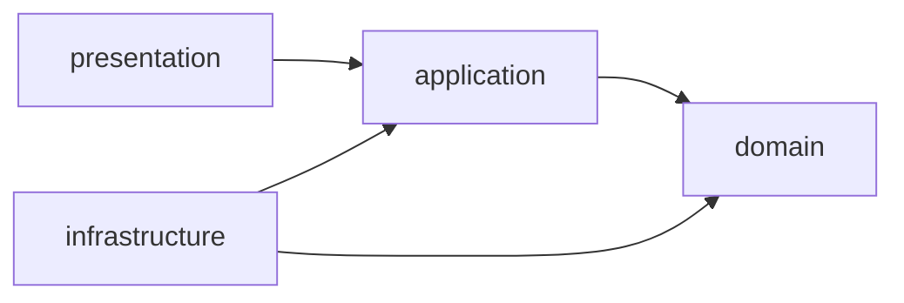

# AGENTS.md

## Project status and scope

This repository is a Java Android Linux-desktop-on-Android host. The long-term product idea is realized as:



Implemented and device-verified on Android 10/API 29 arm64: the curated Ubuntu Base ARM64 download/verify/extract/activate proof (ADR-0006), the packaged standalone PRoot execution bridge (ADR-0004, ADR-0008), the guest-native OpenSSH add-on on the fixed loopback endpoint `127.0.0.1:22022` (ADR-0009, ADR-0010, ADR-0013), the runtime process supervisor under a user-visible foreground service, and the xterm.js WebView terminal. Implemented and device-verified on Android 12/API 31 arm64 (Samsung S10e): the guest `systemctl` service bridge (ADR-0024), the user-chosen workspace bind (ADR-0023), the bounded `udocker compose` adapter (ADR-0025), and the Android capability bridge (ADR-0030) with its live-media (ADR-0031), bounded calendar (ADR-0032), and Termux command compatibility (ADR-0036) slices. Implemented and UX-verified on an x86_64 emulator (API 35): the launcher-first desktop shell, user-local web apps, and the single serialized setup pipeline (ADR-0017). The emulator's ARM translation is **not** runtime evidence; other API levels, 16 KB-page devices, and OEMs remain open.

Still out of scope unless a later task explicitly scopes one of these pieces: a curated desktop web-app profile (Phase 3), target-specific app integration, a second Linux session (the product owns exactly one at a time), LAN/public binding, arbitrary image/package/app installation, and an external SSH client (no remote host, port, profile, or credential UI exists). One narrow exception exists: the ADR-0025 `udocker compose` adapter delegates registry image pulls to udocker's own download path inside the guest. Arbitrary rootfs URLs and arbitrary shell-command host APIs remain out of scope. Do not silently turn a scaffold or documentation task into implementation of one of these out-of-scope pieces.

## Working principles

### YAGNI and KISS

- Build only what an accepted requirement needs now.
- A well-maintained, vetted dependency is usually the better engineering choice:
  it simplifies development and reduces avoidable bugs, so do not hand-roll
  parsing, YAML, crypto, HTTP, compression, or scheduling that a vetted library
  already covers. The JDK/Android SDK is the first choice only when it covers
  the need; hand-rolled code is the fallback, not the default.
- New dependencies follow the existing supply-chain discipline: pin the exact
  version, confirm the license, prefer an established maintenance record, and
  record the vetting rationale next to the dependency (see the pinned
  dependencies in `app/build.gradle`).
- Do not add a framework, dependency, abstraction, configuration layer, or generic registry “for later”.
- A contract is justified when it protects a real boundary, enables a test, or is required by the next vertical slice. Otherwise keep the code local and concrete.
- Prefer one clear implementation over an option matrix. Add an escape hatch only when a real device or target requires it.
- Do not optimize hypothetical scale. Measure a device/runtime problem before introducing caching, queues, or parallelism.

### Clean Architecture dependency direction

The source tree uses these layers:



- `domain/`: pure Java value objects, enums, invariants, and deterministic policies. No Android imports, no file/network/process I/O, no Gradle APIs.
- `application/`: use-case contracts and ports. It may depend on `domain`, but not on Android framework classes or concrete infrastructure.
- `infrastructure/`: Android services, WebView adapters, filesystem, cryptography, download, process, and native-runtime adapters. It implements application ports.
- `presentation/`: Activities/views/ViewModels when introduced. It translates user/system events into application calls and renders explicit states; it does not execute shell commands or own runtime policy.

Do not reverse these dependencies. If a lower layer needs an Android detail, introduce the smallest application port rather than importing Android into the domain.

### Java-only baseline

- Production source is Java. Do not introduce Kotlin, Compose, or a second UI stack without an explicit decision record.
- Use the project Java source/target level from `app/build.gradle`.
- Keep public classes and methods documented when their contract is non-obvious.
- Use immutable value objects where state crosses a layer boundary.
- Validate inputs at boundaries. Never rely on UI validation as the only enforcement.
- Avoid `utils`, `helpers`, and catch-all managers. Name classes by the responsibility they own.

## Security rules

These are design constraints, not optional polish:

- Never directly `execve()` a downloaded executable from writable app storage on modern Android. The future execution bridge must be designed and tested against Android 10+ W^X/SELinux behavior.
- Runtime/rootfs/app payloads must come from an allowlisted, versioned catalog. Do not accept arbitrary URLs or arbitrary shell command strings as the default product API.
- Verify HTTPS transport, cryptographic signature or a securely pinned digest, archive paths, file types, and expected ABI before activation.
- Extract into app-private storage only. Reject absolute paths, `..`, escaping symlinks, device nodes, and unsafe permissions.
- Activate downloads atomically. A partial or failed update must never replace the last known-good version.
- Default all future runtime servers to `127.0.0.1`. Loopback is a reachability restriction, not authentication; add an app token for sensitive endpoints.
- WebView must load only the runtime origin generated by the host. External links leave the WebView for the system browser.
- Do not expose a broad JavaScript interface to runtime or remote content. Any bridge must be minimal, origin-checked, and documented.
- Do not place API keys in source, logs, manifests, process arguments, or crash messages.
- Do not request broad storage, LAN, battery-exemption, or foreground-service permissions without a concrete user-visible requirement and documentation. The one granted exception is the workspace folder (ADR-0023): it is the user's own pick, asked for from a visible explanation, and required for the guest to bind a real host path — and it is still not a general host-filesystem bind.

## Runtime, port, and working-state rules

The future runtime contract is:

- The Android host owns lifecycle and user-facing status.
- The shipped guest SSH endpoint is the fixed loopback port `127.0.0.1:22022` (ADR-0013): the daemon binds that port in one attempt, reports its own bind, and a conflict becomes a typed `FAILED` rather than a move to another port. For any future dynamic endpoint, the guest process binds an ephemeral loopback port and announces readiness through a machine-readable channel; do not reserve a port and then release it before the child binds, because that creates a race.
- Readiness means the advertised health check succeeds, not merely that a PID exists.
- Store explicit states such as `NOT_INSTALLED`, `DOWNLOADING`, `VERIFYING`, `EXTRACTING`, `READY`, `STARTING`, `RUNNING`, `STOPPING`, `STOPPED`, `RECOVERING`, and `FAILED`.
- Persist state before/after operations where recovery needs to distinguish an interrupted transition from a clean stop.
- On process death, report an error and reconcile from disk/process health; never display a false `RUNNING` state.
- Android foreground service work must be user-visible and stoppable. Do not use `dataSync` as an indefinite server process. Do not assume a foreground service guarantees survival on every OEM.
- Do not invoke Linux `systemd`/`service install` from the Android host. Android owns supervision.

## UI rules

- The base Activity is the launcher-first desktop shell, not a fake working runtime.
- Every future runtime screen needs loading, ready, stopped, failure, retry, and insufficient-storage states.
- Keep touch targets accessible, text readable under system font scaling, and layouts usable on small phones and tablets.
- Do not represent state with color alone. Include text and accessible content descriptions.
- Keep UI logic thin. Put state transitions and validation in domain/application code.

## Testing and verification

Before declaring a change complete:

1. Read this file and the closest relevant local skill.
2. Map the requested scope and inspect existing files before editing.
3. Add or update a focused test for changed pure logic.
4. Run the narrow test first, then the relevant Gradle checks.
5. Inspect actual output; a successful command invocation alone is not evidence that the requested behavior works.
6. Update docs/ADR when a decision, public contract, or limitation changes.

Baseline commands:

```bash
./gradlew test
./gradlew lintDebug
./gradlew assembleDebug
```

`./gradlew test` also runs a Robolectric launch test across Android 10–13
(`MainActivityApiLevelLaunchTest`, ADR-0022). It executes real framework code
per API level on the JVM, but no WebView, IME, renderer, or PRoot, so terminal
selection, touch scrolling, keyboard insets, and the runtime bridge still need
device verification. A plain source-text "contract" test is not a substitute
for it: prose checks cannot execute the framework and did not catch the Android
11/12 launch crash.

For future Android/runtime work, add device verification on Android 10+, modern Android, arm64-v8a, a 16 KB page-size environment, process kill/background transitions, corrupt downloads, and WebView reconnects. A unit-test-only result is insufficient for lifecycle or visual behavior.

Never weaken or delete a test to make a build green. If an environment is missing (SDK/device), report that limitation explicitly.

## Documentation and change discipline

- Keep `README.md`, `docs/`, and ADRs aligned with the actual implementation.
- Document why a non-obvious choice exists; do not restate obvious code.
- Use sequential ADRs under `docs/decisions/`.
- Keep changes focused. Unrelated cleanup belongs in a separate change.
- Do not add generated binaries, SDKs, downloaded rootfs archives, secrets, or local machine paths to the repository.
  - **Documented exception — the PRoot execution bridge.** `app/src/main/jniLibs/arm64-v8a/libproot.so` and `libproot-loader.so` are intentionally packaged native artifacts, not ad-hoc generated binaries. They are reproducibly built from pinned source revisions by `scripts/build-proot-arm64.sh`, which fails closed on a pinned-SHA-256 mismatch for both outputs and readelf-verifies the ELF (ADR-0004, ADR-0008). The bridge is an executable PIE renamed `.so` so the Android package installer extracts it into the read-only, executable `nativeLibraryDir`; it is never `dlopen`'d as a JNI library. This exception does not extend to downloaded rootfs archives, target-app payloads, or any other native artifact.
- When a task is explicitly out of scope, create the contract/doc skeleton only; do not add speculative production code.
