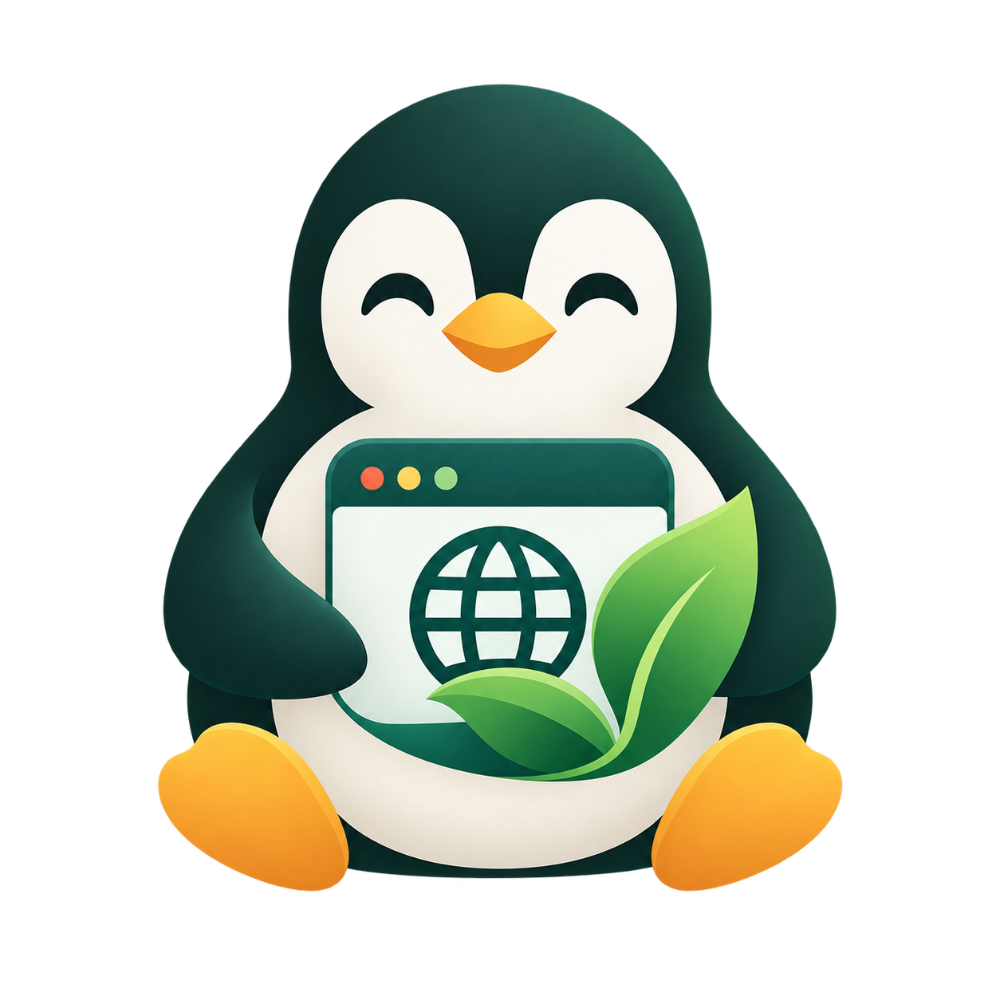
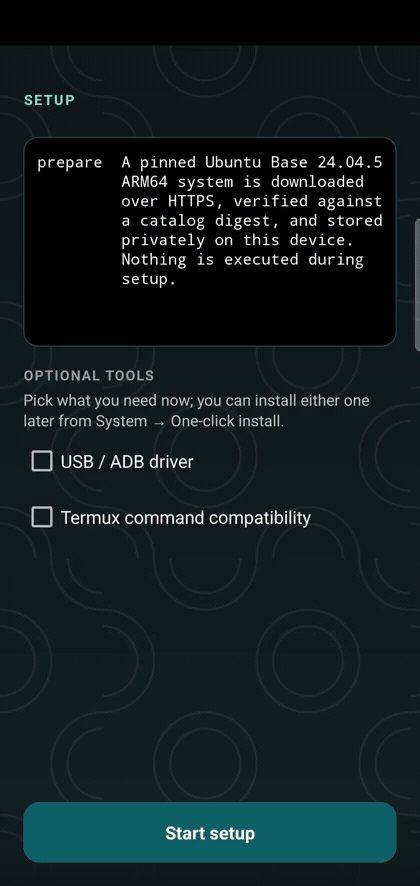

  

<h1 align="center">NusaDesk</h1>

  <strong>Your Linux workspace, at home on Android.</strong> 
  A calm, launcher-first space for your terminal and the web apps you choose.

  <a href="https://github.com/jahrulnr/NusaDesk/releases/latest"><strong>Download NusaDesk</strong></a>

NusaDesk brings a Linux terminal and the tools around it into one focused
Android workspace. Open the launcher to get to work, keep your files in a folder
you choose, and add your own web apps alongside the tools built into NusaDesk.

## Preview

  

Recorded on a Samsung S10e (Android 12): installing Linux from a fresh install,
`apt update` in the terminal, adding a web app, and adding a terminal-command app.
The clips are uploaded as attachments (GitHub renders them as inline players; see
[issue #3](https://github.com/jahrulnr/NusaDesk/issues/3) for the sources).

**Install** — the pinned Ubuntu Base download, verification, extraction, and the launcher unlocking

https://github.com/user-attachments/assets/45599f1e-0c32-4c9f-a493-f1c8ed3f40be

**Terminal** — `apt update` in the guest, then `uname -a` and `/etc/os-release`

https://github.com/user-attachments/assets/14e8db0c-b5da-46b9-9069-9c6deb9adc61

**Add apps** — a web app and a terminal-command app added from the launcher, each opening on its own

https://github.com/user-attachments/assets/f1869a78-881f-4e8f-aa1b-38a82b16903d

Individual clips: [web app](https://github.com/user-attachments/assets/0f5a6f3c-7cb6-4432-84ec-64d31e6395b6) · [terminal command](https://github.com/user-attachments/assets/b7e5c11d-864a-401f-9d7e-daee96f82454)

## Your workspace, your way

- **Work in Linux.** Use a touch-friendly terminal for command-line work on your
  phone, open multiple terminals, and manage them from a compact menu with
  `New`, numbered tabs, and per-terminal `Open` / `Close` actions.
- **Launch a command directly.** Add a terminal-command app with a guest command
  such as `docker exec -it workspace bash`; tapping its tile opens that command
  in its own PTY inside Linux.
- **Keep your files close.** Choose a workspace folder you can use from both
  Android and Linux.
- **Bring your own web apps.** Add the local web apps you rely on to your
  launcher.
- **Stay in your flow.** Linux can keep running while you switch apps, with a
  visible notification and a clear stop control.

NusaDesk is a focused Linux workspace, not a promise to run every desktop Linux
app. Compatibility and background behavior vary by device. It requires Android
10 or newer on an ARM64 device.

## Explore

[What works today](docs/limitations.md) · [Security](SECURITY.md) · [Roadmap](docs/roadmap.md) · [Developer documentation](docs/architecture.md) · [Release notes](CHANGELOG.md) · [License](LICENSE)
