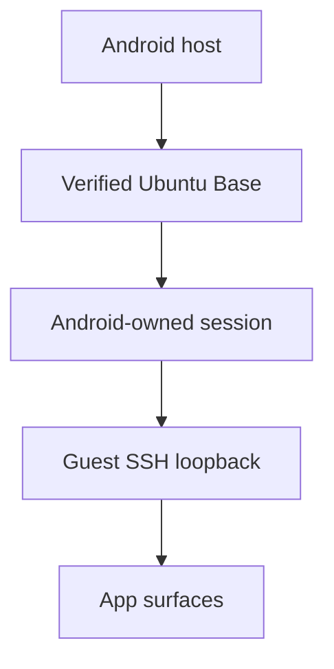
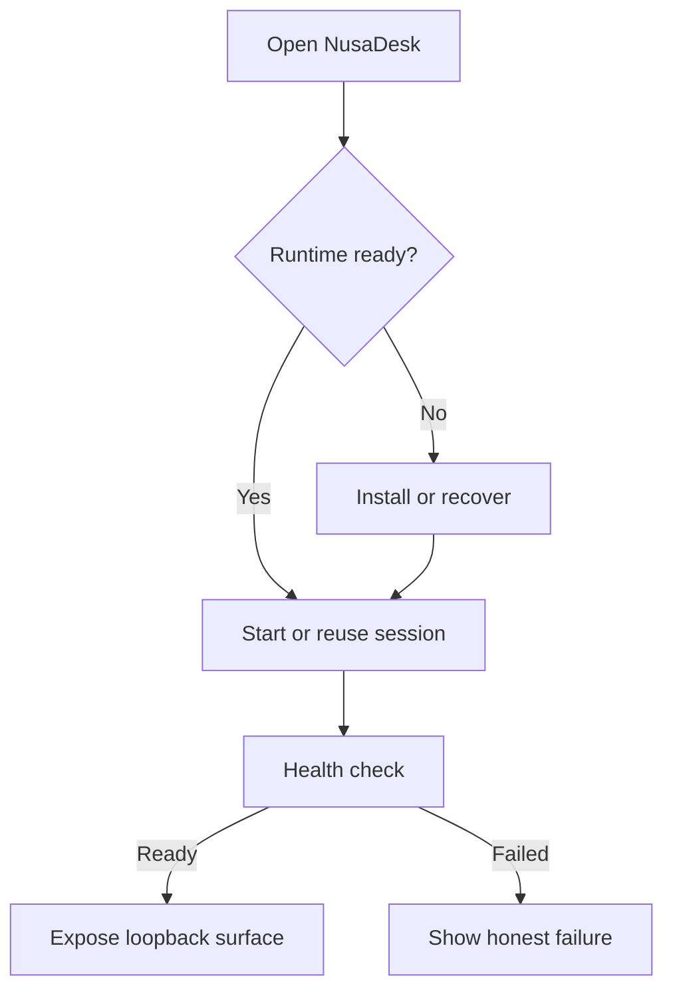

# How NusaDesk works

NusaDesk is an Android host for one curated Linux session. The host owns lifecycle, storage, readiness, and the local app surface.

## Session lifecycle

Linux starts from a visible app launch. The foreground service supervises the session while you move between the launcher, terminal, logs, and local web apps.

## What stays inside the host

- The rootfs is verified before activation and kept in app-private storage.
- The guest endpoint binds to loopback only.
- Android owns process supervision and the foreground notification.
- A running process is not treated as ready until its health check succeeds.

## What the workspace means

The optional workspace is a user-selected host folder mounted at `~/nusadesk` inside Linux. It is a data mount, not a general host filesystem API.

## Logs and troubleshooting

The Logs surface lists the guest files that matter for diagnosis. Open one to follow it live with the same terminal renderer used by the shell. The System surface shows the current state, session, workspace, endpoint, and runtime profile.
