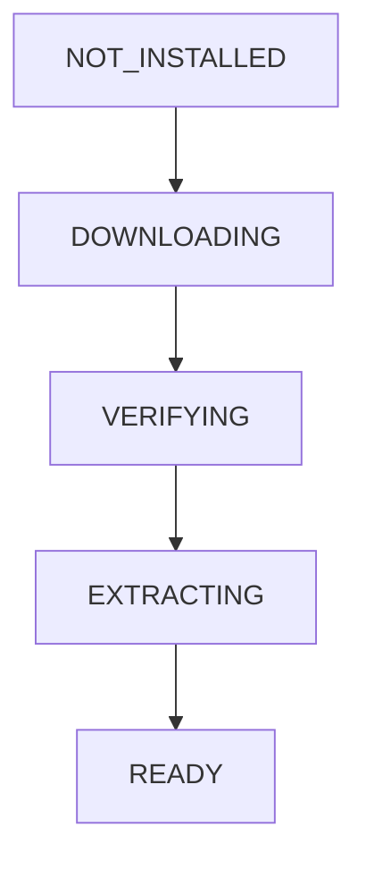
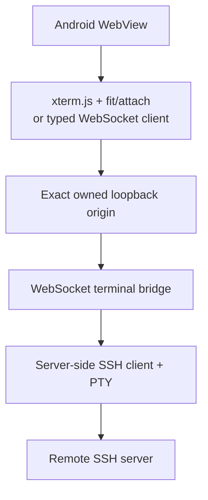

# First vertical slice: Ubuntu Base install and xterm.js SSH research

Research snapshot: 13 September 2026.

## Scope decision

The first proof slice is now deliberately narrower:

- Open the Android app and show the persisted installation state. [unverified]
- Install one product-owned, version-pinned Ubuntu Base ARM64 rootfs on demand. [unverified]
- Verify HTTPS transfer size and SHA-256, safely extract into app-private staging, validate the rootfs, and atomically activate it. [unverified]
- Show `READY` only after activation checks pass; do not claim that a Linux process, HTTP server, WebView, or SSH session is running. [unverified]
- Treat the first target UI as an xterm.js-style web terminal for SSH, but keep the SSH bridge and execution bridge behind unresolved application boundaries until their spikes pass. [unverified]

The current install proof uses Ubuntu Base 24.04.5 ARM64, with the catalog digest pinned to the official `SHA256SUMS` entry.[10] Ubuntu's image documentation distinguishes root tarballs from VM disk formats and documents SHA256/GPG metadata for verification.[9] The catalog uses a 104,728,695-byte extraction budget: 100,784,109 bytes of regular archive files plus the two hard-link copies materialized on Android. [unverified]

## Implemented and certain

### Curated Ubuntu Base payload

`CuratedRuntimeCatalog.ubuntuBaseArm64()` pins the HTTPS URL, version, guest ABI (`linux/arm64`), compressed/uncompressed size budget, and SHA-256 digest. The host checks for an Android `arm64-v8a` device before starting the install. [unverified]

`AndroidRuntimeInstaller` currently performs:

1. available-storage check;
2. HTTPS download to a private `.part` file;
3. exact content-length/size check;
4. SHA-256 verification;
5. safe gzip/tar extraction into a versioned staging directory;
6. path traversal, absolute path, unsafe link, file-type, entry-count, and extraction-size checks;
7. `etc/os-release` and `usr/bin/sh` validation;
8. atomic activation under app-private storage.

The implementation does not execute any extracted binary. This is intentional: Android 10+ prohibits target-29-or-higher apps from directly invoking `execve()` on files in the writable app home directory.[7] [unverified]

### Honest state handling

The UI now supports the real install path: [unverified]

Failures persist as `FAILED` with an actionable detail and `Retry installation`. If the Activity finds an interrupted download/verification/extraction state on restart, it reconciles that state to retryable `FAILED` rather than displaying false success. [unverified]

The on-device proof has completed successfully on the connected Android 10 device: Ubuntu Base 24.04.5 ARM64 downloaded, verified, extracted, activated, and rendered as `READY`. No process was started. [unverified]

## xterm.js target research

### Confirmed architecture

xterm.js is a browser terminal emulator, not an SSH client or shell. Its documented integration pattern connects terminal input/output to a pseudoterminal such as `node-pty`.[1] Official addons extend the terminal; `@xterm/addon-fit` fits the terminal to its container and `@xterm/addon-attach` attaches a terminal to a process over WebSocket.[2]

The recommended first target architecture is therefore:

This avoids implementing SSH cryptography and host-key policy in browser JavaScript. WebSSH2 is a community reference for a server-side SSH2 client proxying a WebSocket/Socket.IO browser connection, with multiple SSH authentication methods and host-key verification features.[4] ttyd is a community reference for a PTY/WebSocket relay and exposes relevant controls such as origin checking, authentication, TLS, client limits, and writable/read-only modes.[5] `node-pty` documents the PTY primitive used by many xterm.js integrations and warns that spawned processes inherit the server's permissions.[6] [unverified]

### Security constraints from the community patterns

- xterm.js terminal input is powerful; the browser page and all JavaScript beside it must be treated as part of the terminal trust boundary.[3]
- The WebSocket must have explicit authentication/authorization and origin validation; the xterm.js security guide warns that its demo attach application is not a production-secured WebSocket solution.[3]
- SSH host-key verification must be explicit. The first SSH bridge should support a reviewed known-hosts/TOFU policy rather than silently accepting a changed key. [unverified]
- Private keys and passwords must stay outside URLs, logs, WebView JavaScript, and process arguments. [unverified]
- The host must keep the WebView on one exact generated loopback origin. Android warns that JavaScript bridges can be called by frames without reliable origin verification, so no broad `addJavascriptInterface` bridge is planned.[12] [unverified]

## Research decisions still open

### Execution bridge

PRoot is a user-space compatibility layer that can run a guest rootfs without privilege and can use QEMU user-mode for another architecture, but it still shares the host kernel and is not a security VM.[8] The project still needs a real Android 10+ execution-bridge spike before any `STARTING` or `RUNNING` implementation is honest. [unverified]

### SSH bridge implementation

The reference choice is a server-side SSH bridge, but the implementation language/library is not fixed. [unverified] Candidate paths are:

- a curated guest-side web terminal bridge based on a maintained community pattern such as WebSSH2/ttyd;
- a small purpose-built bridge with a reviewed SSH library and PTY protocol;
- an Android-native SSH library, only if it can maintain host-key verification, PTY resize, reconnect, and secret handling without expanding the native attack surface.

No candidate is accepted merely because it opens a shell. It must pass host-key, auth, resize, disconnect/reconnect, origin, and process-lifecycle tests. [unverified]

### Ubuntu versus Debian

Ubuntu Base is the first proof artifact because its official ARM64 root tarball and digest are directly available. Debian's official installation guide identifies `debootstrap` as the standard way to create a base system and supports `arm64`, but a device-side `debootstrap`/APT flow would be network-dependent and mutable.[11] For the first profile, prefer a prebuilt, pinned rootfs; evaluate Debian as a second catalog entry after the Ubuntu install/execution boundary is proven. [unverified]

### Session persistence

The target profile still needs a decision for whether reconnect restores the same remote SSH/PTTY session (for example through a guest-side multiplexer) or creates a new session. The UI should not promise session persistence until the bridge proves it. [unverified]

## Next experiments

1. Package the smallest execution bridge into the APK or select a redistributable bridge; prove `/bin/sh` and a loopback health server on Android 10 arm64.
2. Run a deterministic local WebSocket/PTY dummy server and verify exact-origin WebView loading, resize, reconnect, invalid-origin rejection, and process death.
3. Prototype one server-side SSH bridge with host-key verification, public-key authentication, PTY resize, bounded output, and clean disconnect.
4. Add the xterm.js static bundle only after the bridge contract is fixed; avoid a remote CDN and pin the frontend assets.

## Sources
- [1] https://github.com/xtermjs/xterm.js/blob/master/README.md
- [2] https://xtermjs.org/docs/guides/using-addons
- [3] https://xtermjs.org/docs/guides/security
- [4] https://github.com/billchurch/webssh2
- [5] https://github.com/tsl0922/ttyd
- [6] https://github.com/microsoft/node-pty
- [7] https://developer.android.com/about/versions/10/behavior-changes-10
- [8] https://proot-me.github.io
- [9] https://ubuntu.com/docs/public-images/public-images-reference/artifacts
- [10] https://cdimage.ubuntu.com/cdimage/ubuntu-base/releases/24.04/release/SHA256SUMS
- [11] https://www.debian.org/releases/stable/arm64/apds03.en.html
- [12] https://developer.android.com/privacy-and-security/risks/insecure-webview-native-bridges